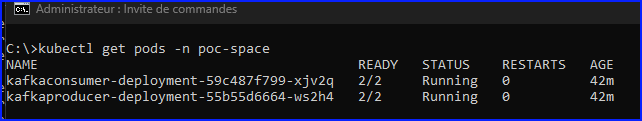

# Introduction
Playing with kafka

# Dev version
Using kafka as docker image

# Prod version
Using k8s - rancher

## Steps
### Docker
```
cd .\src\POC.KafkaTuto\POC.WorkerConsumer\
docker build -t kafkaconsumer:latest .
docker tag kafkaconsumer:latest sadrifertani/kafkaconsumer:latest
docker push sadrifertani/kafkaconsumer:latest
```

```
cd .\src\POC.KafkaTuto\POC.WorkerProducer\
docker build -t kafkaproducer:latest .
docker tag kafkaproducer:latest sadrifertani/kafkaproducer:latest
docker push sadrifertani/kafkaproducer:latest
```

### Helm
```
helm lint ./helm/POC.WorkerConsumer
helm install kafka-consumer ./helm/POC.WorkerConsumer -n poc-space
helm upgrade kafka-consumer ./helm/POC.WorkerConsumer -n poc-space

helm lint ./helm/POC.WorkerProducer
helm install kafka-producer ./helm/POC.WorkerProducer -n poc-space
helm upgrade kafka-producer ./helm/POC.WorkerProducer -n poc-space
```

```
helm uninstall kafka-consumer -n poc-space
helm uninstall kafka-producer -n poc-space
```

```
kubectl delete pod kafkaconsumer-deployment-98bdd759b-7rt29 -n poc-space
kubectl delete pod kafkaproducer-deployment-794d56469f-tbfs8 -n poc-space
```

## Check pods creation
```
kubectl describe pod kafkaconsumer-deployment-98bdd759b-7rt29 -n poc-space
```

## Secret
```
kubectl get secret kafka-secret -n poc-space
kubectl create secret generic kafka-secret --from-literal=Kafka__Password=******** -n poc-space
```

## Debug
```
kubectl run curl-test --image=curlimages/curl:latest --restart=Never --command -- sleep 3600
kubectl get pods
kubectl exec -it curl-test -- /bin/sh
> curl http://monapi-service.api-space.svc.cluster.local/get-config
```

## Traces



